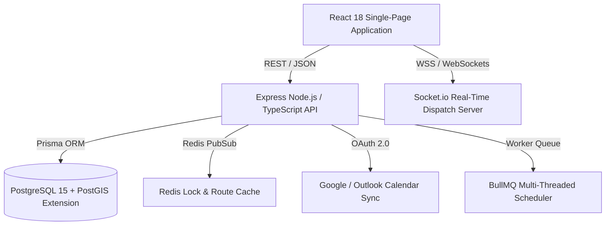

# DropIn Version 2.0 — Architecture & Technical Implementation Specification

## Executive Summary
This document outlines the technical architecture, scheduling engine algorithms, PostGIS-enabled PostgreSQL Prisma schema, containerization strategy, and detailed Jira story breakdown for **DropIn Version 2.0**, an At-Home Grooming Services Marketplace ("Wolt for Barbers").

---

## 1. System Architecture Updates



### Tech Stack Integration
- **Frontend**: React 18 SPA (Vite), Tailwind CSS v4, Lucide React, Google Maps JS API, HTML5 Geolocation.
- **Backend API**: Node.js, Express, TypeScript (Strict mode enabled).
- **ORM & Database**: Prisma ORM v5 with `postgresql` connector and `postgis` spatial extension for custom polygon geographical checks.
- **Real-Time Communication**: Socket.io / WebSockets for live specialist GPS tracking, SOS emergency alerts, and immediate order dispatch broadcasts.
- **Containerization**: Multi-stage Docker container build (`node:20-alpine`) running behind Cloud Run / Nginx.

---

## 2. Algorithmic Deep Dive: Scheduling & Route Optimization

### Route Optimization Algorithm (Backtracking with Traveling Salesperson Problem Solver)
To optimize daily stop sequences for specialists while accounting for travel time, service duration, and appointment windows:

```typescript
interface AppointmentStop {
  id: string;
  lat: number;
  lng: number;
  serviceDurationMins: number;
  scheduledTimeWindowStart: Date;
  scheduledTimeWindowEnd: Date;
}

export function solveSmartRouteBacktracking(
  startLocation: { lat: number; lng: number },
  stops: AppointmentStop[],
  calculateTravelTimeMins: (fromLat: number, fromLng: number, toLat: number, toLng: number) => number
): AppointmentStop[] {
  let bestRoute: AppointmentStop[] = [];
  let minTotalTime = Infinity;

  function permute(currentRoute: AppointmentStop[], remainingStops: AppointmentStop[], currentLat: number, currentLng: number, accumulatedTime: number) {
    if (remainingStops.length === 0) {
      if (accumulatedTime < minTotalTime) {
        minTotalTime = accumulatedTime;
        bestRoute = [...currentRoute];
      }
      return;
    }

    for (let i = 0; i < remainingStops.length; i++) {
      const nextStop = remainingStops[i];
      const travelTime = calculateTravelTimeMins(currentLat, currentLng, nextStop.lat, nextStop.lng);
      const arrivalTime = accumulatedTime + travelTime;
      const totalCost = arrivalTime + nextStop.serviceDurationMins;

      // Pruning condition: If current time exceeds minimal total found, prune branch
      if (totalCost >= minTotalTime) continue;

      const newRemaining = remainingStops.filter((_, idx) => idx !== i);
      permute([...currentRoute, nextStop], newRemaining, nextStop.lat, nextStop.lng, totalCost);
    }
  }

  permute([], stops, startLocation.lat, startLocation.lng, 0);
  return bestRoute;
}
```

---

## 3. Database Schema (Prisma / PostgreSQL + PostGIS)

```prisma
datasource db {
  provider   = "postgresql"
  url        = env("DATABASE_URL")
  extensions = [postgis]
}

generator client {
  provider        = "prisma-client-js"
  previewFeatures = ["postgresqlExtensions"]
}

enum Role {
  CUSTOMER
  PROVIDER
  ADMIN
}

enum BookingStatus {
  PENDING
  ACCEPTED
  EN_ROUTE
  IN_SERVICE
  COMPLETED
  CANCELLED
}

model User {
  id              String      @id @default(uuid())
  email           String      @unique
  fullName        String
  phone           String
  role            Role        @default(CUSTOMER)
  idVerified      Boolean     @default(false)
  idDocumentUrl   String?
  referralCode    String      @unique @default(uuid())
  rewardPoints    Int         @default(0)
  createdAt       DateTime    @default(now())

  addresses       Address[]
  subscriptions   Subscription[]
  providerProfile ProviderProfile?
  bookings        Booking[]
}

model Address {
  id            String   @id @default(uuid())
  userId        String
  title         String   // Home, Office, Hotel
  streetAddress String
  aptUnit       String?
  intercomCode  String?
  parkingNotes  String?
  latitude      Float
  longitude     Float
  isDefault     Boolean  @default(false)

  user          User     @relation(fields: [userId], references: [id], onDelete: Cascade)
}

model ProviderProfile {
  id                String      @id @default(uuid())
  userId            String      @unique
  category          String      // Barber, Nails, Blowout, Massage
  bio               String
  baseServiceFee    Float
  rating            Float       @default(5.0)
  isAvailableNow    Boolean     @default(true)
  hygieneBadges     String[]    // ["Barbicide Certified", "Dyson Specialist"]
  equipmentVerified Boolean     @default(true)
  
  // Custom Polygon Zone stored in PostGIS
  coverageZoneGeoJson Unsupported("geometry(Polygon, 4326)")?

  user              User        @relation(fields: [userId], references: [id])
  crmNotes          ClientCRMNote[]
  services          ServiceBundle[]
}

model Booking {
  id                String         @id @default(uuid())
  customerId        String
  providerId        String
  status            BookingStatus  @default(PENDING)
  scheduledStartTime DateTime
  scheduledEndTime   DateTime
  
  // Group & Family Bookings
  isGroupBooking    Boolean        @default(false)
  groupPartyCount   Int            @default(1)
  
  // Cost Itemization
  baseFee           Float
  travelFee         Float
  peakSurgeFee      Float          @default(0)
  offPeakDiscount   Float          @default(0)
  tipAmount         Float          @default(0)
  totalAmount       Float

  customer          User           @relation(fields: [customerId], references: [id])
  reviews           Review[]
}

model Subscription {
  id                String    @id @default(uuid())
  userId            String
  planName          String    // Bi-Weekly Fade Pass
  monthlyPrice      Float
  frequencyWeeks    Int       @default(2)
  status            String    @default("active")
  nextBillingDate   DateTime
  user              User      @relation(fields: [userId], references: [id])
}

model ClientCRMNote {
  id                String          @id @default(uuid())
  providerProfileId String
  clientName        String
  notes             String          // Guard sizes, color formula
  beveragePref      String?
  provider          ProviderProfile @relation(fields: [providerProfileId], references: [id])
}

model ServiceBundle {
  id                String          @id @default(uuid())
  providerProfileId String
  title             String          // Father & Son Combo
  durationMins      Int
  price             Float
  provider          ProviderProfile @relation(fields: [providerProfileId], references: [id])
}

model GiftVoucher {
  id                String   @id @default(uuid())
  code              String   @unique
  amount            Float
  senderEmail       String
  recipientEmail    String
  isRedeemed        Boolean  @default(false)
}

model Review {
  id                String   @id @default(uuid())
  bookingId         String   @unique
  rating            Int
  comment           String
  photoUrls         String[]
  verifiedCutBadge  Boolean  @default(true)
  booking           Booking  @relation(fields: [bookingId], references: [id])
}
```

---

## 4. Agile Jira Tickets (20 Features Breakdown)

### Epic 1: Customer Experience Enablers
- **JIRA-101**: *Group & Family Bookings*
  - **Description**: Enable booking multiple group members in a single checkout session.
  - **Acceptance Criteria**:
    - Users can add 1-5 additional party members with individual service selections.
    - System applies a shared travel fee discount (-30 ILS) for multi-person bookings.
    - Time duration automatically sums and reserves appropriate calendar block.
- **JIRA-102**: *Recurring Subscriptions*
  - **Description**: Automated bi-weekly or monthly grooming memberships.
  - **Acceptance Criteria**:
    - Select subscription plan (Bi-Weekly Fade Pass / Monthly VIP).
    - Provide pause/resume functionality and auto-waive travel surge fee for subscribers.
- **JIRA-103**: *Style Inspiration Feed*
  - **Description**: Lookbook feed of haircuts, beard trims, and blowouts.
  - **Acceptance Criteria**:
    - Grid view of trending styles with tags, likes, and category filters.
    - "Book This Look" button pre-fills booking flow with selected style title.
- **JIRA-104**: *Saved Multi-Address Management*
  - **Description**: Saved address book with gate codes and parking notes.
  - **Acceptance Criteria**:
    - CRUD address entries (Home, Office, Hotel).
    - Store gate/intercom code and parking guidance for specialist dispatch.
- **JIRA-105**: *E-Gifting & Digital Vouchers*
  - **Description**: Digital gift card purchasing and instant code redemption.
  - **Acceptance Criteria**:
    - Customize gift amount, recipient email, and theme.
    - Instant code generator and input form to redeem credit to wallet balance.

### Epic 2: Provider Tools & Optimization
- **JIRA-106**: *Interactive Coverage Zone Polygon Drawing*
  - **Description**: Map canvas boundary drawer for providers.
  - **Acceptance Criteria**:
    - Radius slider & custom polygon preset selection.
    - Store boundary in PostGIS format and enforce geolocation checks.
- **JIRA-107**: *Smart Route Optimization*
  - **Description**: Automated daily stop sequencing for specialists.
  - **Acceptance Criteria**:
    - Re-order appointments to minimize travel time and fuel consumption.
    - Display travel time buffers between consecutive stops.
- **JIRA-108**: *Client CRM & Private Notes*
  - **Description**: Private notes for haircut guard sizes and beverage preferences.
  - **Acceptance Criteria**:
    - Provider search by client name/phone.
    - Save text notes for clipper guard sizes, razor sensitivity, and beverage choices.
- **JIRA-109**: *External Calendar Sync (Google/Outlook)*
  - **Description**: Sync calendar events via OAuth / iCal feeds.
  - **Acceptance Criteria**:
    - Connect Google Calendar OAuth to block busy times automatically.
    - Export DropIn appointment feed in `.ics` format.
- **JIRA-110**: *Custom Service Bundles & Add-ons*
  - **Description**: Create multi-person packages & add-ons.
  - **Acceptance Criteria**:
    - Set title, price, and duration for custom bundles (e.g., Father & Son Combo).
- **JIRA-111**: *Instant Payouts & Financial Dashboard*
  - **Description**: 24/7 instant payout trigger and earnings dashboard.
  - **Acceptance Criteria**:
    - Real-time available balance tracker with tip breakdown.
    - One-click trigger for instant bank transfer and tax PDF download.

### Epic 3: Trust & Safety
- **JIRA-112**: *Two-Sided ID Verification*
  - **Description**: ID scan badge for providers and clients.
  - **Acceptance Criteria**: Display "Verified Pro / Verified Client" status badge on profiles.
- **JIRA-113**: *In-Service Emergency Assist (SOS Button via Web)*
  - **Description**: Floating web SOS alert button during active bookings.
  - **Acceptance Criteria**: Broadcast live GPS location, trigger police call (100), and notify emergency contacts.
- **JIRA-114**: *Dynamic Travel Fee Breakdown*
  - **Description**: Transparent checkout cost itemization.
  - **Acceptance Criteria**: Itemize Base Fee + Distance Travel + Peak Surge + Off-Peak Discount.
- **JIRA-115**: *Provider Skill & Hygiene Badges*
  - **Description**: Display verified certifications on specialist profiles.
  - **Acceptance Criteria**: Badge tags (Barbicide Sanitation Certified, Master Fade, Dyson Airwrap Certified).
- **JIRA-116**: *Cancellation Fee Protection*
  - **Description**: Policy enforcement (100% refund >24h, 50% refund <12h, 0% refund <2h).

### Epic 4: Platform Growth & Retention
- **JIRA-117**: *Off-Peak Dynamic Pricing*
  - **Description**: 15-20% discount on quiet weekday morning hours (9 AM - 12 PM).
- **JIRA-118**: *Referral & Loyalty Program*
  - **Description**: Give 50 ILS, Get 50 ILS code generator and Silver/Gold/Platinum VIP tiers.
- **JIRA-119**: *Verified Photo Reviews*
  - **Description**: Customer photo uploads of completed haircuts with star ratings and verified badge.
- **JIRA-120**: *Provider Equipment Checklist*
  - **Description**: Pre-departure safety checklist (Sterilized Clippers, Disinfectant Spray, Ring Light) before en-route status.
